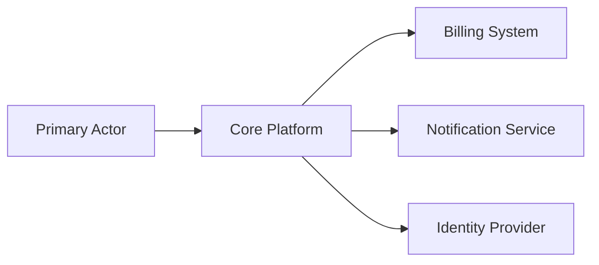
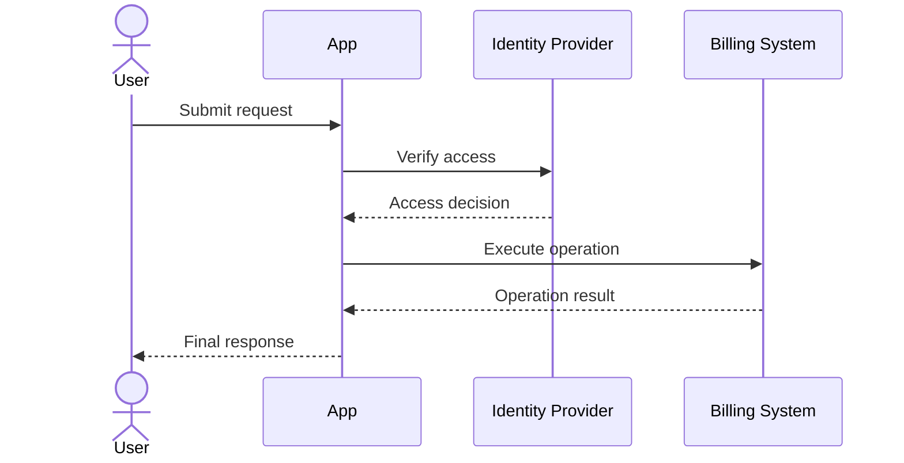
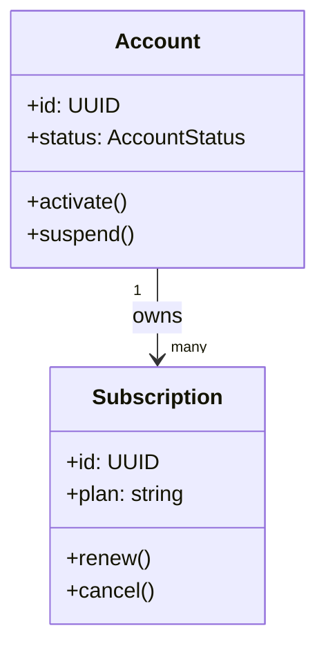

# Diagram Patterns

## System Context (architecture.md)

## Use Case Interaction (use_cases.md)

## Domain UML (uml.md)

## Style Guidance

1. Keep diagrams high-level and architecture/domain focused.
2. Avoid method-level call chains from implementation classes.
3. Show only meaningful actors, systems, and domain entities.
