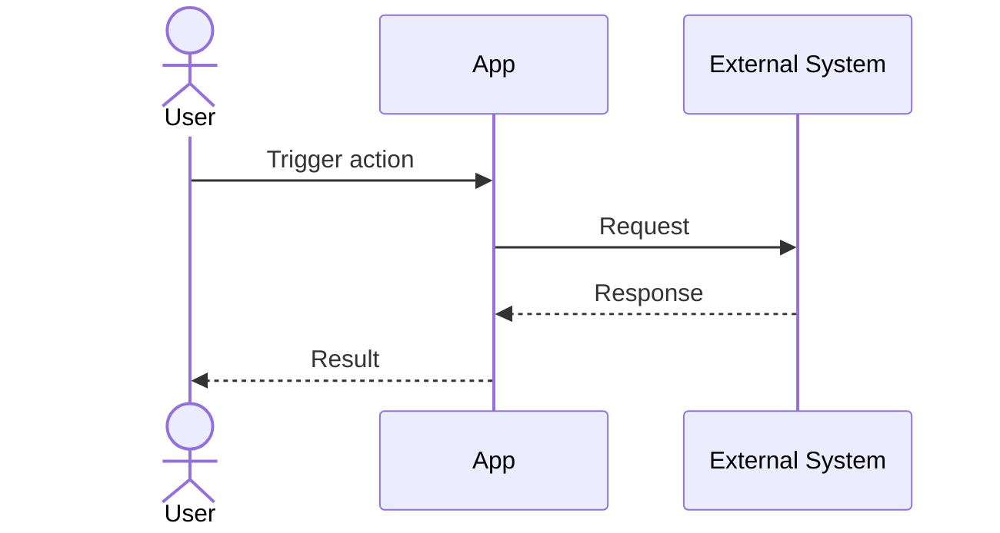
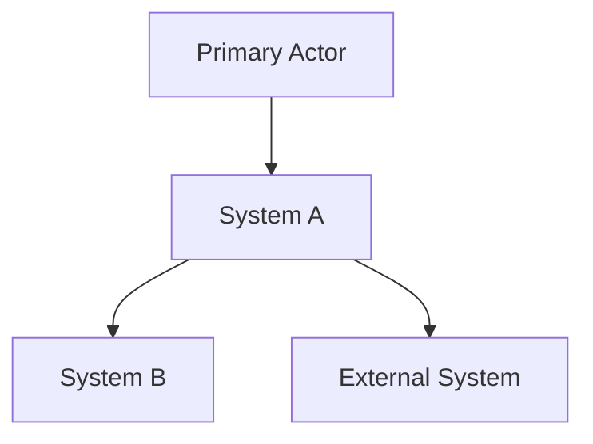
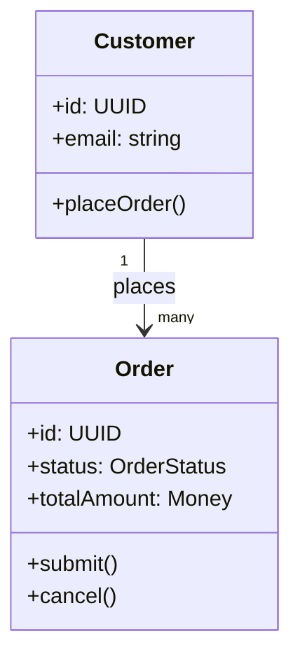

# Documentation Templates

## requirements.md

```markdown
# Requirements

## 1. Purpose and Scope

## 2. Business Goals

## 3. Functional Requirements
### FR-001 <title>
- Description:
- Rationale:
- Acceptance Criteria:

## 4. Non-Functional Requirements
### NFR-001 <title>
- Description:
- Metric/Target:
- Verification:

## 5. Constraints and Assumptions

## 6. Traceability Snapshot
- FR to UC mapping summary
```

## use_cases.md

```markdown
# Use Cases

## Actors

## Use Case Catalog
### UC-001 <title>
- Primary Actor:
- Trigger:
- Preconditions:
- Main Flow:
1. ...
- Alternate Flows:
- Exceptions:
- Postconditions:
- Related Requirements: FR-xxx

## Interaction Diagrams
### UC-001 Sequence

```

## specification.md

```markdown
# Specification

## 1. Architectural Style
- Chosen style(s):
- Rationale:

## 2. System Operations and Contracts
### CON-001 <title>
- Systems:
- Purpose:
- Preconditions:
- Inputs:
- Processing Guarantees:
- Outputs:
- Postconditions:
- Failure Modes:
- Idempotency / Retry:
- Observability:

## 3. Data and Event Exchange Principles

## 4. Security and Compliance Constraints
```

## architecture.md

```markdown
# Architecture

## 1. System Context


## 2. Systems and Responsibilities
- SYS-001:
- SYS-002:

## 3. Relationship Matrix
- Source -> Target : responsibility of interaction

## 4. Deployment / Runtime Notes (High Level)
```

## uml.md

```markdown
# UML

## Domain Model


## Notes
- Model domain concepts and behaviors.
- Omit framework/ORM artifacts.
```

## tests.md

```markdown
# Testing Strategy

## 1. Scope

## 2. Requirement Coverage
- FR-001 -> unit/integration/e2e references
- NFR-001 -> performance/security/reliability checks

## 3. Test Levels
- Unit:
- Integration:
- End-to-End:
- Non-Functional:

## 4. Quality Gates
- Gate 1:
- Gate 2:

## 5. Risks and Gaps
```
